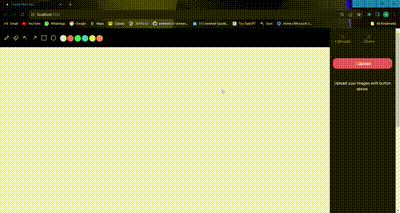

# Canvas Application in Next.js

This project is a canvas application built with Next.js, KonvaJs, and styled with TailwindCss.

## Installation

1. Clone the repository
2. Install the dependencies using `npm install`

## Running the Application

Run the application using `npm run dev`

## Features

1. **Image Manipulation**: Images can be uploaded or dropped onto the canvas. These images can be rotated, resized, and dragged along the canvas.
   - 
2. **Shape Drawing**: Basic shapes like squares and circles can be drawn on the canvas. These shapes can be resized and dragged.
   - 
3. **Sketching Tool**: The application includes a sketching tool with the following features:
   - Sketching on the canvas
   - A pen whose color can be changed
   - An eraser
   - Undo and Redo functions
   - 
4. **Share Feature**: The canvas can be downloaded using the share feature.
   - 

Enjoy using the application!
